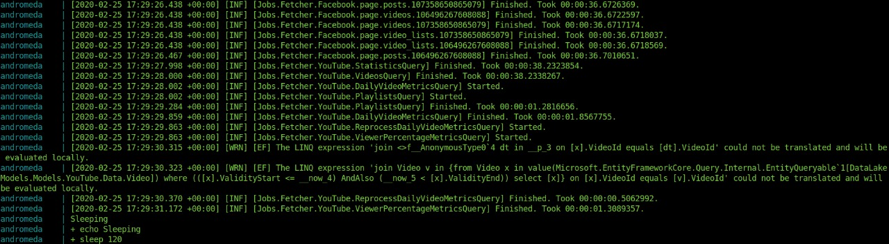

# Introduction

This documentation shows how to configure and run Andromeda container.
All the steps on this document were tested on ubuntu 18. If you plan to run this tutorial on a Windows machine, you will need to adapt the steps that use terminal commands.

# Summary

* [Prerequisites](#Prerequisites)
* [Configuration files](#Configuration-files)
* [Andromeda](#Andromeda)
  + [Getting the credentials](#Getting-the-credentials)
  + [Creating the folder structure](#Creating-the-folder-structure)
  + [Configuring the appsettings.json](#Configuring-the-appsettings.json)
  + [The docker container](#The-docker-container)
    - [Editing the `andromeda/docker-compose-andromeda.yml` ](#Editing-the-`andromeda/docker-compose-andromeda.yml` )
    - [Running the container](#Running-the-container)
  + [Development tips](#Development-tips)
    - [Prune unused local volumes](#Prune-unused-local-volumes)
    - [Build from a local copy of the repositories](#Build-from-a-local-copy-of-the-repositories)
    - [Forcing docker-compose up to rebuild](#Forcing-docker-compose-up-to-rebuild)

# Prerequisites

* Docker
* Docker compose

[Instructions of how to install Docker on ubuntu](https://docs.docker.com/install/linux/docker-ce/ubuntu/)

[Instructions of how to install Docker Compose on ubuntu](https://github.com/docker/compose/releases)

# Configuration files

In order to run Andromeda in the docker container, first, we need to set up Andromeda’s configuration files.

# Andromeda

## Getting the credentials

The first step to run Andromeda is to get the credentials for each social media
that you want to pull out data from. The credential files are used to allow
Andromeda to pull your data from the Social Media APIs. You can get more
information about how to get and configure the credentials for each social media
[here](./how_to_get_credentials.md).

## Creating the folder structure

In order to run the Andromeda container you need to place the Credentials in a folder structure that can be seen [here](./credential_folder_structure.md).

## Configuring the appsettings.json

The last step to configure Andromeda is to create and configure the file appsettings.json. On this file, we will need to set up the data lake information for Andromeda to be able to connect with it. The information that we need is:

    - Host: The link to the database, if you plan to run the database as a container leave this with the container name.
    - Database: Database name.
    - Username: Database username.
    - Password: Database password.
    - Port: Port in which the database is listening.

All this information should be on a unique string separated by semicolon (; ), you can see an example below.

If you are running the database in containers, all these values should match the values put in the docker-compose.yml files.

Here is an example of how to configure Andromeda to run with a postgres container set up as the data_lake on the docker-compose-andromeda.yml (default configuration).

Create an `appsettings.json` file on the andromeda-config folder with a text editor of your preference. To illustrate the process, we will be using vim. You can create and open the file with the vim editor executing the following command on a terminal:

``` bash
vim appsettings.json
````

Copy the following snippet in the newly created file:

``` json
{
    "ConnectionStrings": {
        "DataLakeDatabase": "Host=data_lake;Database=data_lake;Username=fee;Password=dbpassword;Port=5433"
    }
}
```

Save and close the file.

## The docker container

Once you have the folders andromeda-config with all the necessary files, we need to clone Andromeda repository. The repository contains all the docker files necessary to build the Andromeda container.
To clone Andromeda repository run the following command on a terminal:

``` bash
git clone https://github.com/Jellyfish-Insights/andromeda
```

After we have cloned Andromeda repository, the next step will be configuring docker-compose files.

### Editing the `andromeda/docker-compose-andromeda.yml`

By default, the Andromeda container will search for a folder called andromeda-config with the credentials and the appsettings.json on the directory where the docker-compose-andromeda.yml is located. We don't recommend to put the folder with the credentials inside the git repository folder.

You can change the path of the andromeda-config folder by editing the docker-compose-andromeda.yml file. The following steps show how to edit this file using the terminal and the vim text editor.

Go to Andromeda’s directory and navigate to.

``` bash
cd andromeda
```

Open the docker-compose-andromeda.yml file with vim:

``` bash
vim docker-compose-andromeda.yml
```

Locate the line under the Andromeda service:

* ./andromeda-config:/app/release/credentials

  Change the path on the left side of ':' to the path to your andromeda-config folder which you have all the credentials and the file appsettings.json.
  [OPTIONAL][changing fetcher time] Locate the line under the Andromeda service:

* FETCH_SLEEP_TIME=120 #seconds

  Andromeda's fetchers fetch the social media data every "X" seconds. This variable controls how much time the fetchers will wait to run again.
  Close and save the file.
  You can edit the docker-compose-andromeda.yml as you need it, this file has descriptions for all important fields necessary to run the application. If you change the database information (recommended on production) don't forget to update the appsettings.json with the corresponding changes.

### Running the container

Before running the Andromeda container, we need to kill any postgres process running on your computer. You can do this by executing the following command on terminal:

``` bash
sudo pkill -9 postgres
```

To run the Andromeda container, open a terminal and then navigate to the andromeda folder:

``` bash
cd andromeda
```

Then execute the following command:

``` bash
sudo docker-compose -f docker-compose-andromeda.yml up andromeda
```

Now we have Andromeda container running, you should see something like this:



## Development tips

### Prune unused local volumes

If you are building the images multiple times to test your code, it's useful before running the docker-compose files prune the unused local volumes. By doing this, you will have a fresh build, starting everything from scratch. Run the command below on a terminal window to prune unused local volumes:

``` bash
sudo docker volume prune
```

### Build from a local copy of the repositories

By default, the docker-compose files will build the image from the files stored in the remote repositories: https://github.com/Jellyfish-Insights/andromeda

Therefore, to see your code changes applied to the docker container, you will need to push the files to the corresponding directories.

You can change this by changing the Dockerfile used in the service's build command in each docker-compose.yml by the local. Dockerfile version.

### Forcing docker-compose up to rebuild

By default, docker-compose command doesn't rebuild the image, even if you change a file in the build process. To force docker-compose to rebuild your image, instead of the default command docker-compose up use the following one:

``` bash
sudo docker-compose -f docker-compose-andromeda.yml up --build --force-recreate andromeda
```

Explanation:
--build: build images before starting containers.
--force-recreate: Recreate containers even if their configuration and image haven't changed.
--build is straightforward and it will create the docker images before starting the containers.

The --force-recreate flag will stop the currently running containers forcefully and spin up all the containers again even if you do not have changed anything into its configuration. So, if there are any changes, those will be picked-up into the newly created containers while preserving the state of volumes.

