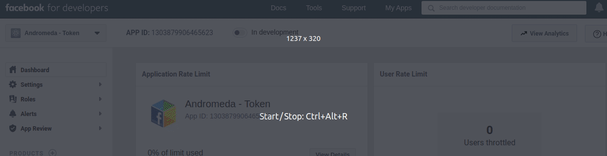
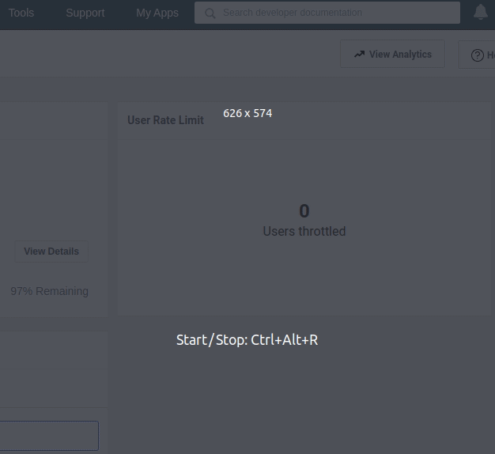
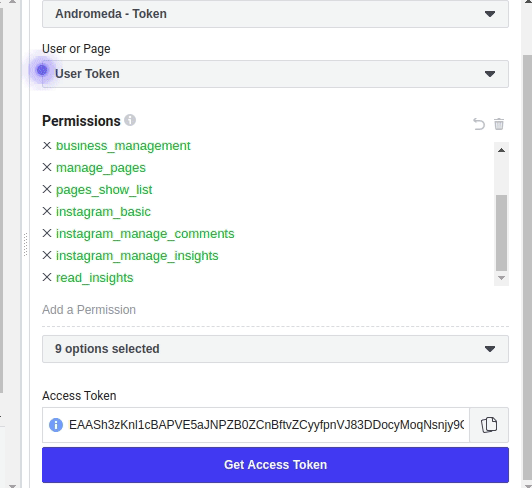
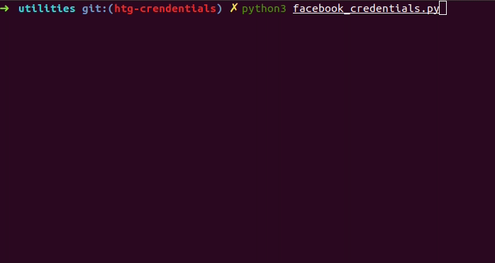
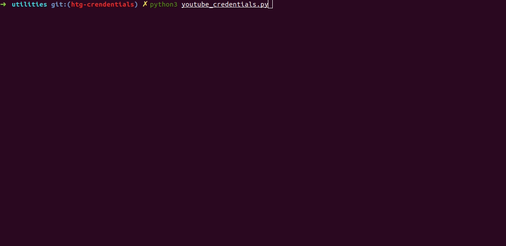

# Running Andromeda python scripts to get the social media credentials

## Introduction

This document will guide you on how to get your social media credentials by
running the Andromeda python scripts.

By running the python script **facebook_credentials.py** you can get your
Facebook Page, Facebook Marketing and Instagram credentials.

By running the python script **youtube_credentials.py** you can get your YouTube
credential.

All this python scripts are located in the folder utilities.

## Prerequisites

To run the python scripts you need to have **Python v3.6 or higher** installed on your computer and also the following libraries:

- [Request](https://pypi.org/project/requests/)
- [Google oauth lib](https://pypi.org/project/google-auth-oauthlib/)

## Credentials folder structure

The output of the python scripts will be a folder called **credentials** and
inside it, the credentials files will be placed. This folder will be created in the same
directory that the python scripts are located. The **credentials** folder
follows the folder structure required by Andromeda to run.

Therefore, you can copy the generated credentials folder to where you plan to
run Andromeda.

You can see more about the folder structure that Andromeda uses [here](./credential_folder_structure.md).

## Facebook/Instagram Credentials

Before getting the Facebook Pages, Facebook Marketing (adaccount) and Instagram
credentials, we need to create a Facebook Application. A Facebook Application
will identify the Andromeda's python script as a valid application and allows it
to acquire the credentials.

After we have Facebook application, we will need to configure file
`utilities/fb_client_secrets.json` in order to run the python scripts.

### Requirement

All the steps below consider that you have a Facebook developer account and that
bound to it you have a **Facebook Page, Facebook Marketing and/or an Instagram business account**.

When you run the python script you will get the credentials to social media that
are bounded to your Facebook account.  For instance, if you have a Facebook
developer account, and you bound to It only your Page, the script will return
for you just the Page credential.

### Creating a Facebook application

The following steps demonstrate how to create a Facebook application and
configure Andromeda's python script to use it.

1. Go to https://developers.facebook.com/ -> My Apps -> Create App
2. Go to **Settings** -> **Basic**
3. Find and copy your `App ID` and `App Secret`.

   The following gif image demonstrate where to find the `App ID` and `App Secret` on the https://developers.facebook.com/.

   

4. On your computer, go to where you cloned the Andromeda repository. In
   sequence, open the file `utilities/fb_client_secrets.json` with a text editor
   and paste the `App ID` that you got on step 3 on the "<APP_ID>" field and the
   `App Secret` on the field "<APP_SECRET>". Don't close the file yet, we will
   be adding one more information to it.

5. Go back to your browser and open https://developers.facebook.com/tools/explorer/
6. Click on **Get Token** -> **Get User Access Token** and make your log-in.
7. Click on **Add a Permission** and select the fields:
      - ads_management
      - ads_read
      - business_management
      - manage_pages
      - pages_show_list
      - read_insights
      - instagram_basic
      - instagram_manage_insights
      - instagram_manage_comments

    The following gif image summarizes the steps 5, 6 and 7.

    <div align="center">
        </br>
        
        </br></br>
    </div>

8. Click on **Get Access Token** and select the Instagram business account and
   Pages wanted.
9. Copy your `Access Token`.

    The gif below summarizes the step 8 and 9.

    <div align="center">
        </br>
        
        </br></br>
    </div>

10. Go back to your text editor where you have the
    `utilities/fb_client_secrets.json` file opened. Paste your `Access Token` on the
    field "USER_ACCESS_TOKEN".

11. Save and close the file.

In the end of this process your `utilities/fb_client_secrets.json` file should
be something like this:

```json
{
    "APP_ID" : "1303879906465623",
    "APP_SECRET" : "34c9a9317163c41bcc4cfea19195b9cf",
    "USER_ACCESS_TOKEN" : "EAASh3zKnl1cBALiuftI***************************************************"
}
```

### Running the Facebook script

Once we have `utilities/fb_client_secrets.json` filled with all the needed
information, we can get our Facebook Page, Facebook Marketing and our Instagram
credentials by running the following command:

```bash
cd utilities
python3 facebook_credentials.py
```

<div align="center">
    </br>
    
    </br></br>
</div>

This command will create all necessary credentials to fetch your data from
Facebook API. After you finish to execute the python script you should have the
following folder structure on your utilities folder:

```
utilities
|  facebook_credentials.py
|  fb_client_secret.json
|  youtube_credentials.py
|
└─ credentials
  |
  └─ facebook
  | |  user_credentials.json
  | |
  │ └── adaccount
  | |    adaccount-id1_credentials.json
  | |    adaccount-id2_credentials.json
  │ └── page
  │      page-id1_credentials.json
  │      page-id2_credentials.json
  |
  └─ youtube
  |
  |
  └─ adwords
  |
  └─ instagram
      instagram-id1_credentials.json
```

Move this **credentials folder** to where you plan to run Andromeda.

## YouTube Credentials

The Medium article [Fetching YouTube Data using
Andromeda](https://medium.com/@insightsjellyfish/fetching-youtube-data-using-andromeda-8f1b1240803c)
explains how to get your YouTube Credentials. However, you can also use the
python scripts described in this section to accomplish the same task.

To run the Python script to get your YouTube credential your need to create a
Google API project and get a Google client Id and client secret for Andromeda.
The **Client Id** and **client secret** are unique strings that will identify Andromeda
as a valid application and allows it to acquire tokens.

Both the **Client Id** and **client secret** have to be placed in a file called
**client_secret.json**. The following section explains how to get
**client_secret.json** file.

### Getting the client_secret.json

The Medium article [Fetching YouTube Data using
Andromeda](https://medium.com/@insightsjellyfish/fetching-youtube-data-using-andromeda-8f1b1240803c)
explains how to get the client_secret.json, we recommend that
you follow the steps described there and come back here after have your token
ready.

**Note: You don't need to run all the steps, once you have your
client_secret.json file you can come back and run the script**

After getting your client_secret.json file, paste it into the `utilities` folder.

### Running the YouTube script

After you have the client_secret.json file in the the `utilities` folder, you can
run the python script to get your YouTube Credentials by running the following
command on terminal:

```bash
python3 youtube_credentials.py
```

When you execute script, it will open a screen on your browser for you to make
login with the google account related to the YouTube Channel that you want to Fetch data.

<div align="center">
    </br>
    
    </br></br>
</div>

After running the python script you should have the
following folder structure on your utilities folder:

```
utilities
|  facebook_credentials.py
|  fb_client_secret.json
|  youtube_credentials.py
|  client_secret.json
|
└─ credentials
  |
  └─ facebook
  |
  └─ youtube
  |  |  client_secret.json
  |  |
  |  └── channel_1
  |  |    Google.Apis.Auth.OAuth2.Responses.TokenResponse-Credentials.json
  |  └── channel_2
  |       Google.Apis.Auth.OAuth2.Responses.TokenResponse-Credentials.json
  |
  └─ adwords
  |
  └─ instagram
```

Move this **credentials folder** to where you plan to run Andromeda.
