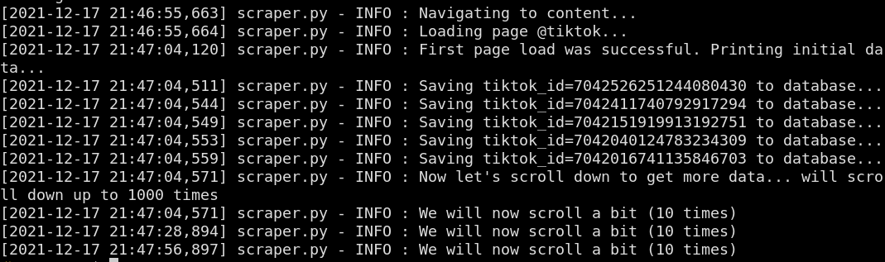

## What is this?
This sets up a service which scrapes data from social media periodically.
The accounts to be scraped are fetched from a containerized database
Later, the scraped data can be retrieved from the same database.
This was designed as a tool for the [Andromeda project](https://github.com/Jellyfish-Insights/andromeda).


## How to run the program?

Build the Docker images and then run it with
```
docker-compose -f <FILE> build && docker-compose -f <FILE> up
```

We have both a development and a production version pre-configured.

## Environment variables
File `docker-compose.yml` accepts two paramenters:
- **sleep_interval**: how long the program should sleep between two every
run (an integer)
- **random_order**: whether the jobs listed in `jobs` folder should be run in
a random order (otherwise, they will run in alphabetical order)

## Debugging the GUI

In addition to these arguments, we have one extra which can be used to restrict access
to the graphic terminal in development mode:
- `VNC_SERVER_PASSWORD` is optional unless you are using Mac. If you are on
Ubuntu and leave this empty, then the VNC will simply be accessible without
a password.

The Docker command will open a container whose port 5900 is connected to port 5900 of the host. If you want to check out what is going on inside the container, you can connect to the GUI with a client such as `vncviewer`, like so: `vncviewer localhost:5900`.

After a bunch of stuff related to GUI is printed, you should see something like that:

