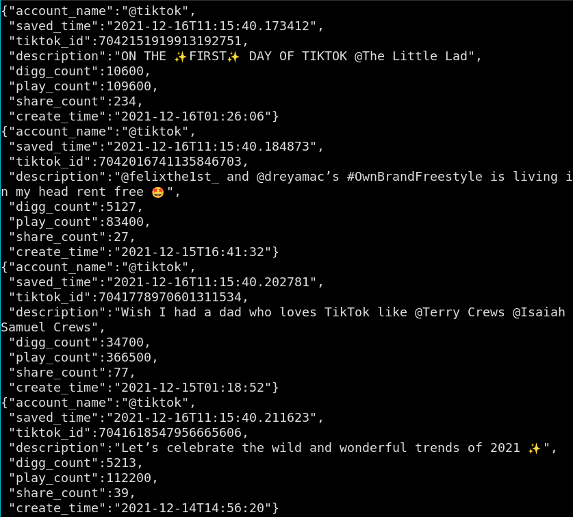
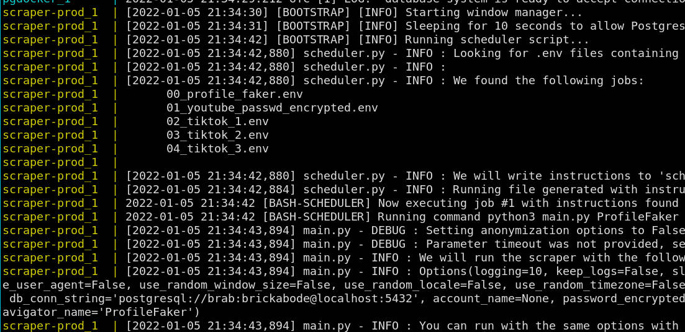

## What is this?
This sets up a service which scrapes data from social media periodically.
The accounts to be scraped are fetched from a containerized database
Later, the scraped data can be retrieved from the same database.
This was designed as a tool for the [Andromeda project](https://github.com/Jellyfish-Insights/andromeda).



## How to run the program?

For this scraper, we will follow the same pattern as the credentials from the
rest of Andromeda project. Please consult further documentation and examples
there.

Place `.json` files for every job you would like to run in the folder `src/jobs`.
You can define different users, each with their set of jobs. For every user,
you must create subdirectories whose names are the names of their respective
scrapers (e.g. `tiktok`, `youtube` etc. — case insensitive). Example jobs are
included in this repository. If you would like your jobs to run in a specific
order, please prefix a numeric index to its name, e.g. `00_my_youtube_job.json`.
Jobs will run by default in alphabetical order, though random order is also
possible (see below).

Besides instructions which are specific to each job, you might also want to set
global constants, such as a database connection string. Please name this file as
`appsettings.json` and place it directly under `jobs/` directory. This will be
valid for every user and every job.

The data (.csv, .json files) resulting from your jobs will be saved to
`src/extracted_data` folder, which, in the Docker container, gets linked to the
host filesystem.

Build the Docker images and then run it with
```
docker-compose -f docker-compose.dev.yml build --build-arg APP_UID=$(id -u) \
&& docker-compose -f docker-compose.dev.yml up
```

We have both a development and a production version pre-configured (just change the
word `dev` above to `prod`). You can also use other settings by changing the
environment variables below. Using `--build-arg APP_UID=$(id -u)` is advisable,
but unnecessary in the case you are the only user of your computer (i.e. your
UID is 1000).

### Environment variables
File `docker-compose.yml` accepts two paramenters:
- **sleep_interval**: how long the program should sleep between two every
run (an integer)

### Running the scraper from a local machine (no Docker)

You can also run the scraper directly, which allows a greater level of
customization. You can have an overview of the CLI options by running
`main.py -h`:

```
usage: main.py [-h] [--logging {10,20,30,40,50}] [--keep_logs] [--slow_mode]
               [--use_disposable_profile] [--no_disposable_profile]
               [--use_fake_user_agent] [--no_fake_user_agent]
               [--use_random_window_size] [--no_random_window_size]
               [--use_random_locale] [--no_random_locale] [--use_random_timezone]
               [--no_random_timezone] [--force_logout] [--no_force_logout]
               [--use_anonymous] [--no_use_anonymous] [--scroll_limit SCROLL_LIMIT]
               [--timeout TIMEOUT]
               [--account_name ACCOUNT_NAME]
               [--password_encrypted PASSWORD_ENCRYPTED]
               [--password_plain PASSWORD_PLAIN]
               [--credentials_file CREDENTIALS_FILE]
               {TikTok,YouTube,TestNavigator,ProfileFaker}
```

You do not need to enforce all of these options, in fact, some options only make
sense in a certain context, when exploring one type of social media. The navigators
for every social media come with defaults, so you only _need_ to provide the
credentials, when applicable. However, if you wish, the settings can also be
tweaked as desired.

### Success
You will know you had success running the container/the scraper if you get a
message like this:



## Authentication
Some of the social media requires authentication for logging in. This normally
comes as an account name and a password. At some point, our program will have
to access your password as plain-text. For an additional (though not completely
secure) layer of protection, you can store and send your password in a
symmetrically encrypted form.

Beware that the key to decrypt your password will also be in a file inside the
project and an attacker possessing both the key and the encrypted password will
be able to retrieve your password. Do not share either of these or post them
online.

For your convenience, there is a utility for encrypting and decrypting your
password. From the `src` directory, run `python3 -m scripts.passwd_manager`
and follow the instructions.

Please note that two-factor authentication needs to be disabled so password login
can work without human intervention.

## Debugging

### Attaching to a running process
Unfortunately, it is not possible to attach PDB (Python Debugger) to a running
process the same way you would attach GDB to a C program. [Some](https://stackoverflow.com/questions/54205110/attaching-python-debugger)
[workarounds](https://devguide.python.org/gdb/) have been tried, but they are so
inconvenient they should really be the last option. Therefore, your best bet is to
closely analyze the log files.
### Log files

If you run the program as a container, log files will be available at the volume
mounted to `logs`. The verbosity level of log messages can also be changed
for every individual job by passing `logging` parameter in the `.json` file.
This parameter can take values {10,20,30,40,50}, where 10 includes all messages
and 50 only critical messages.

### Debugging the GUI
Sometimes the scraper might not work and you have no clue why. It is hard to tell,
because we cannot see what is on the screen at Chrome. For this reason, the
development version has support for attaching a GUI client.

The Docker command will open a container whose port 5900 is connected to port
5900 of the host. If you want to check out what is going on inside the container,
you can connect to the GUI with a client such as `vncviewer`, like so:
`vncviewer localhost:5900`. When requested, type in the password `123456`.

In the future we want to add periodical screenshots for debugging purposes.

## Troubleshooting

If you get a message like this:
```
Message: unknown error: cannot connect to chrome at 127.0.0.1:33559
from session not created: This version of ChromeDriver only supports Chrome version 97
Current browser version is 96.0.4664.110
```

It means that your container has an old version for Chrome. The library Undetected
Chrome driver contains a hook to always use the latest version available for Chrome,
and the Dockerfiles contain instructions to fetch this latest version. However,
if you have built the container before, your Docker might use a cached version for
the command, and thus install an old image. To solve this, pass option `--no-cache`
when running `docker build`. If you are running locally, please use
`sudo apt update && sudo apt upgrade -y` or equivalent.

## Getting blocked

Sometimes, you will get blocked. We are working to give the scrapers a natural
human-like behavior, but it is a robot and cannot anticipate all of the situations.
Besides, if you are scraping too often, the websites will likely spot your unusual
behavior.
### Getting a credible browser fingerprint

If you are accessing a service that requires authentication, you won't want to
use a random profile. This is already enabled by default, so you don't have to
worry about it, unless you are using custom options.

Still, if you are accessing your profile with a 100% fresh browser, with no
cookies, no cache, no browser history, no extensions etc, it might cause suspicion.
Even if this data cannot be always directly obtained, websites can use very
sophisticated tricks to get a general idea of who you are (your fingerprint).

What you can do to increase the credibility of your profile is: before you access
your authenticated service, use `ProfileFaker` navigator to go around some of the
most popular websites and collect cookies and the like. It is not much, but might
help avoiding detection.
