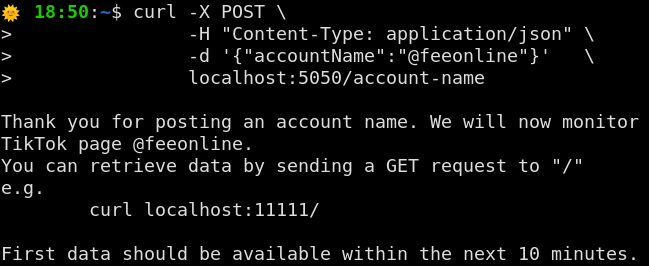
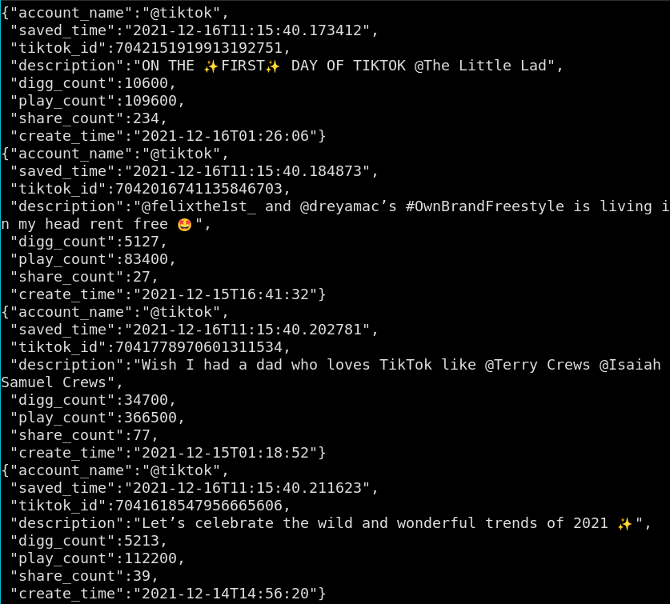
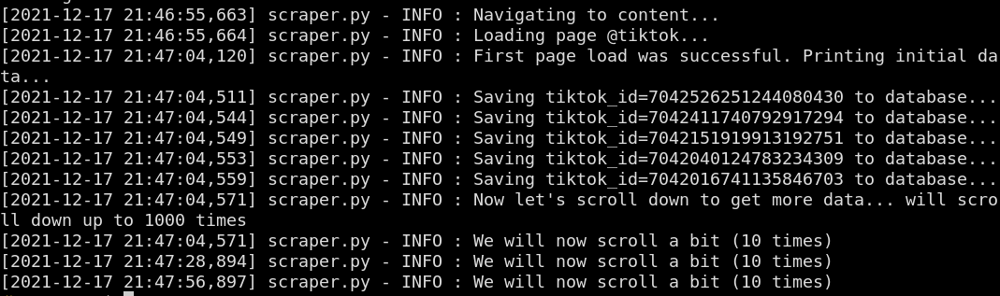

## What is this?
This sets up a server which receives TikTok account names to be followed, and
starts gathering data from them. Later, this data can be retrieved from the same
server. This was designed as an API for the [Andromeda project](https://github.com/Jellyfish-Insights/andromeda).




## How to run the program?

Build the Docker images and then run it with
```
docker-compose build && docker-compose up
```

## Environment variables
File `docker-compose.yml` accepts a number of parameters, which you can tune to
better suit the tool to your needs. These parameters mirror the CLI options for
the program, and further documentation can be found there. If you do not know
what to use, leave the options as they are. Removing the environment variables from 
`docker-compose.yml` will break the program.

```
usage: server.py [-h] [--scroll_limit SCROLL_LIMIT] [--timeout TIMEOUT]
          [--scraping_interval SCRAPING_INTERVAL]
          [--db_conn_string DB_CONN_STRING]
          [--keep_logs] [--slow_mode] [--quiet]
          account_name
```

- `scroll_limit`. Larger values will take longer to load, but will also fetch
data from a larger portion of the screen.
- `timeout`. Defines how long the program can run before being killed. A value
of zero can be used for no timeout, however, it is recommended to be used as a
failsafe. It is also recommended that the timeout is shorter than the `scraping_interval`,
defined below.
- `scraping_interval`. Defines how long it should take between two interactions
of the scraper. Some actions, such as posting a new account name, may reset this
interval.
- `db_conn_string`. Contains a string with credentials for connecting to the
database.

The following options are *flags*, and can either be present (true) or not (false):

- `keep_logs` will make the server and the scraper output logs and save them to
text files, for later debugging.
- `slow_mode` will make the scraper go 2 times slower, and is better at avoiding
detection and reducing load.
- `quiet` will inhibit all messages, except of ERROR and CRITICAL level.

Besides the above options, the program takes a sole argument, `account_name`:
- `account_name` (mandatory). It takes the name of the account, with the `@`

In addition to these arguments, we have one extra which can be used to restrict access
to the graphic terminal:
- `VNC_SERVER_PASSWORD` is optional unless you are using Mac. If you are on
Ubuntu and leave this empty, then the VNC will simply be accessible without
a password.

The Docker command will open a container whose port 5900 is connected to port 5900 of the host. If you want to check out what is going on inside the container, you can connect to the GUI with a client such as `vncviewer`, like so: `vncviewer localhost:5900`.

After a bunch of stuff related to GUI is printed, you should see something like that:

